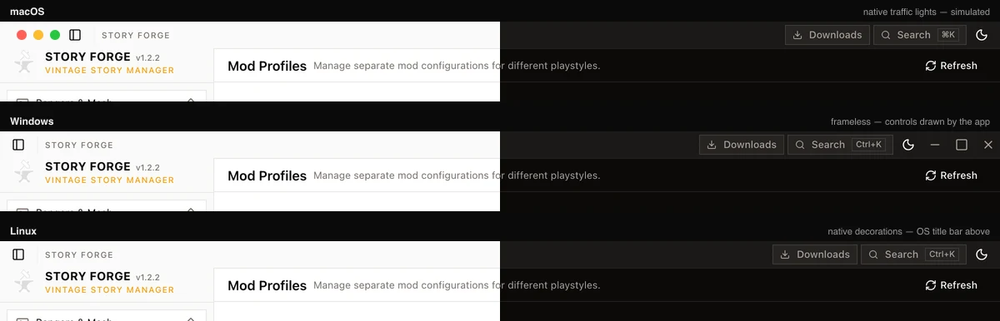

<p align="center">
   <a href="https://getstoryforge.app/">
      
   </a>
   <br />
   <br />
   <a href="/actions">
      
   </a>
   <a href="/LICENSE">
      
   </a><br />
   <a href="https://discord.gg/gByx63peUC">
      
   </a>
   <a href="https://getstoryforge.app/">
      
   </a>
   <a href="/releases/latest">
      
   </a>
</p>

# Story Forge

A modern desktop manager for [Vintage Story](https://www.vintagestory.at/): install and switch
game versions, manage **profiles** (isolated data folders with their own mods, worlds and
settings), browse and update mods, join servers, host dedicated servers, and edit mod configs.

> [!WARNING]
> **macOS Users:** Story Forge is not notarized yet, so macOS Gatekeeper may block it from launching. After installing, run the following in your terminal to allow the app:
>
> ```sh
> sudo xattr -rd com.apple.quarantine /Applications/Story\ Forge.app
> ```

The core domain concept is the **profile**:

- a profile is a full Vintage Story data directory (`Mods/`, `Saves/`, `Maps/`, `ModConfig/`,
  `Logs/`, `clientsettings.json`) pinned to a game version,
- game binaries live once per version in a shared versions folder — profiles only reference
  them,
- profiles can be created, switched, renamed, cloned, exported/imported (file or `SF1.` share
  code), and soft-deleted with undo.

## Features

- **Profiles** — a `Default` profile is created automatically on first run (pinned to the
  newest installed version, or the newest release), the active profile can't be deleted,
  and at least one profile always remains. Create/switch/clone/rename, soft delete with
  undo, export to file or copy a share code, import from file/code with automatic mod
  downloads. Installations from the previous Story Forge release are detected and can be
  imported in one click (move or copy — same data, converted manifest).
- **Profile backups** — zip snapshots of a profile's mods, worlds and configs, taken manually
  or automatically before each launch (per-profile switch, retention keeps the newest N).
  Restoring rolls the folder back to that moment.
- **Adopt existing game data** — if Vintage Story data already exists in the game's default
  location (`VintagestoryData`), Story Forge offers to use it as a profile in one click.
  Nothing is copied or moved; removing the profile only unregisters the folder.
- **Import from other launchers** — installations from
  [VS Launcher](https://github.com/XurxoMF/vs-launcher) and its continuation
  [RiftLauncher](https://github.com/StratumServer/RiftLauncher), instances from
  [Rustory](https://github.com/XurxoMF/rustory),
  [GruntLauncher](https://github.com/renarin-kholin/gruntlauncher),
  [Lithic](https://github.com/NotAShelf/lithic),
  [Yelloowstone](https://github.com/jgwoolley/vintage-story-launcher) and
  [Waxlight Launcher](https://github.com/AmadoMuerte/Waxlight-launcher), modpacks from
  [MVL](https://github.com/scgm0/MVL) and packs from
  [Cairn](https://github.com/cairns-gg/cairn-app) are detected and imported as profiles
  (move or copy), preserving the game version, mods and worlds. Launch parameters,
  environment variables, pin state and playtime are carried over where the source stores
  them.
- **Link existing game versions** — builds already installed by those launchers (or any
  folder picked manually) are detected and linked in place, so profiles can launch without
  re-downloading. Unlinking never touches the files.
- **Versions** — browse all Vintage Story releases, download with a resumable, pausable queue.
- **Optimum client** — install the [Optimum](https://github.com/StratumServer/Optimum) performance fork
  for an installed version in one click: Story Forge downloads the official overlay from Optimum's
  releases, verifies the archive and every file against its SHA-256 manifest, copies the version to
  `1.22.7+optimum` and patches the copy — the original stays vanilla, and profiles pick either build.
  Updates are offered when a newer overlay still supports the game version. Linux and Windows (x64)
  only; Optimum publishes no macOS or arm64 overlay.
- **Mods** — search the mod database, filter by version/side/tags/author, install, update,
  downgrade, remove, and update everything at once. Installs read each mod's `modinfo.json`
  and queue its missing dependencies (recursively) in the downloads sheet; installed mods are
  also checked for missing dependencies, with a one-click "Install missing" banner. Pin a mod
  to keep its installed version — pinned mods are left out of the update check, so "Update All"
  skips them (unpin to see updates again).
- **Modpacks** — browse/install community modpacks (optional cloud login via Better Auth),
  create and publish your own.
- **Deep links** — `storyforge://install?mod=<id>` opens a ModDB mod in the app and
  `storyforge://install?pack=<slug>` opens a cloud modpack's detail sheet, so links shared outside
  the app land on the right install flow. `sf:` is accepted as an alias.
- **Pack locks** — pin a profile's mods to exact versions and SHA-256 hashes (`storyforge.lock.json`
  beside `profile.json`), see drift at a glance, and run an explicit **Sync / repair** that downloads
  missing or mismatched mods through ModDB and verifies every file against the lock. Exports, share
  codes and structured cloud modpacks carry the lock, imports enforce it immediately, and mods the
  lock does not name are reported as extras rather than removed.
- **Worlds** — list saves across profiles, edit/delete, launch straight into a world, and view
  the in-game map with markers and prospecting data.
- **Servers** — save servers, probe them (version/password/whitelist checks), connect, and
  browse the public server list.
- **Server hosting** — run dedicated Vintage Story servers with console, config editor,
  whitelist management and port checks.
- **Mod configs** — live JSON editor and Monaco code editor for `ModConfig/*.json`.
- **Accounts** — multiple Vintage Story accounts with TOTP support.
- **Localized UI** — English, German, French, Spanish, Brazilian Portuguese, Russian and
  Simplified Chinese. Follows the system language by default and switches live from Settings.
- **Light & dark theme**, command palette (⌘K / Ctrl+K), keyboard shortcuts, auto-updater.

## Screenshots

|                Profiles                |              Mod browser              |                 Add a mod                 |
| :------------------------------------: | :-----------------------------------: | :---------------------------------------: |
|  |  |  |

|                Versions                |               Worlds               |                   Public servers                   |
| :------------------------------------: | :--------------------------------: | :------------------------------------------------: |
|  |  |  |

|               Servers                |               Hosting                |                 Mod configs                  |
| :----------------------------------: | :----------------------------------: | :------------------------------------------: |
|  |  |  |

|              News              |                Settings                |
| :----------------------------: | :------------------------------------: |
|  |  |

The window chrome adapts per platform — native traffic lights on macOS, controls drawn by the app
in the frameless Windows build, and native decorations on Linux (traffic lights simulated in the
render):



All screenshots are 1200×800 captures of the app UI, split light/dark along the diagonal; they are
refreshed headlessly on every published release. See
[screenshots/README.md](screenshots/README.md) for the pipeline, including the platform chrome
preview (`bun run screenshots:platforms`).

## Translations

All UI strings live in per-area catalogs under `src/lib/i18n/locales/` — English is the source
of truth and every other locale mirrors it (missing keys fall back to English). To add or update a
language, see [src/lib/i18n/README.md](src/lib/i18n/README.md) and run the parity check:

```sh
bun run check:i18n        # keys, {{placeholders}} and <Trans> tags across all locales
```

## Nix

A flake is available for `x86_64-linux`, `aarch64-linux` and Apple Silicon macOS:

```sh
nix build github:LovelessCodes/StoryForge   # build (./result)
nix run github:LovelessCodes/StoryForge     # Linux: build and launch
nix develop                                 # dev shell with Bun, Rust and the Tauri prerequisites
```

On macOS the bundle is at `./result/Applications/Story Forge.app`. The flake resolves the frontend
dependencies with [bun2nix](https://github.com/nix-community/bun2nix) — after changing `bun.lock`,
regenerate `bun.nix` from the dev shell with `bun2nix -o bun.nix`. Intel Macs are not supported
(nixpkgs dropped `x86_64-darwin` in 26.11).

## Development

```sh
bun install
bun tauri dev     # run the desktop app
bun run build     # typecheck + frontend build
bun tauri build   # bundle the app
```

Requires Bun, Rust (1.85+) and the [Tauri prerequisites](https://tauri.app/start/prerequisites/).

### Layout

```
src/                  React 19 + TanStack Router/Query + Zustand frontend
  components/ui/      Base UI primitives (Macheim design system)
  components/layout/  titlebar, sidebar, header, main layout
  components/<area>/  feature pages and sheets
  hooks/ stores/      data layer (ported from the original app, renamed to profiles)
  lib/                helpers, types, notify, query client
src-tauri/            Rust backend (Tauri v2)
  src/modules/        profiles, versions, mods, servers, hosting, saves, maps, auth, dotnet…
```

App data lives in the platform app-data directory (macOS: `~/Library/Application Support/StoryForge`),
with `profiles/`, `versions/`, `hosted-servers/`, logs and settings inside. Both the profiles
and versions folders can be relocated in Settings.

### Notes

- The updater endpoint still points at the original project's release feed; the version is ahead
  of it so no downgrade is offered.
- `STORYFORGE_OPTIMUM_ORIGIN` (`http://127.0.0.1:<port>`) and `STORYFORGE_OPTIMUM_RID`
  (`linux-x64`/`win-x64`) point the Optimum install flow at a local origin so it can be exercised
  on a machine Optimum publishes no overlay for. The origin is honoured only for loopback
  addresses, and nothing in a shipped build sets either variable.
