# Story Forge

A modern desktop manager for [Vintage Story](https://www.vintagestory.at/): install and switch
game versions, manage **profiles** (isolated data folders with their own mods, worlds and
settings), browse and update mods, join servers, host dedicated servers, and edit mod configs.

This is a remake of the original Story Forge (see `../test-app`) with the interface rebuilt in
the look & feel of Macheim (see `../macheim`). The core domain concept is the **profile**:

- a profile is a full Vintage Story data directory (`Mods/`, `Saves/`, `Maps/`, `ModConfig/`,
  `Logs/`, `clientsettings.json`) pinned to a game version,
- game binaries live once per version in a shared versions folder — profiles only reference
  them,
- profiles can be created, switched, renamed, cloned, exported/imported (file or `SF1.` share
  code), and soft-deleted with undo.

## Features

- **Profiles** — a `Default` profile is created automatically on first run (pinned to the
  newest installed version, or the newest release), the active profile can't be deleted,
  and at least one profile always remains. Create/switch/clone/rename, soft delete with
  undo, export to file or copy a share code, import from file/code with automatic mod
  downloads. Installations from the previous Story Forge release are detected and can be
  imported in one click (move or copy — same data, converted manifest).
- **Adopt existing game data** — if Vintage Story data already exists in the game's default
  location (`VintagestoryData`), Story Forge offers to use it as a profile in one click.
  Nothing is copied or moved; removing the profile only unregisters the folder.
- **Import from other launchers** — installations from
  [VS Launcher](https://github.com/XurxoMF/vs-launcher) and its continuation
  [RiftLauncher](https://github.com/StratumServer/RiftLauncher), instances from
  [Rustory](https://github.com/XurxoMF/rustory),
  [GruntLauncher](https://github.com/renarin-kholin/gruntlauncher),
  [Lithic](https://github.com/NotAShelf/lithic),
  [Yelloowstone](https://github.com/jgwoolley/vintage-story-launcher) and
  [Waxlight Launcher](https://github.com/AmadoMuerte/Waxlight-launcher), modpacks from
  [MVL](https://github.com/scgm0/MVL) and packs from
  [Cairn](https://github.com/cairns-gg/cairn-app) are detected and imported as profiles
  (move or copy), preserving the game version, mods and worlds. Launch parameters,
  environment variables, pin state and playtime are carried over where the source stores
  them.
- **Link existing game versions** — builds already installed by those launchers (or any
  folder picked manually) are detected and linked in place, so profiles can launch without
  re-downloading. Unlinking never touches the files.
- **Versions** — browse all Vintage Story releases, download with a resumable, pausable queue.
- **Mods** — search the mod database, filter by version/side/tags/author, install, update,
  downgrade, remove, and update everything at once. Installs read each mod's `modinfo.json`
  and queue its missing dependencies (recursively) in the downloads sheet. Pin a mod to keep
  its installed version — pinned mods are left out of the update check, so "Update All" skips
  them (unpin to see updates again).
- **Modpacks** — browse/install community modpacks (optional cloud login via Better Auth),
  create and publish your own.
- **Worlds** — list saves across profiles, edit/delete, launch straight into a world, and view
  the in-game map with markers and prospecting data.
- **Servers** — save servers, probe them (version/password/whitelist checks), connect, and
  browse the public server list.
- **Server hosting** — run dedicated Vintage Story servers with console, config editor,
  whitelist management and port checks.
- **Mod configs** — live JSON editor and Monaco code editor for `ModConfig/*.json`.
- **Accounts** — multiple Vintage Story accounts with TOTP support.
- **Light & dark theme**, command palette (⌘K), keyboard shortcuts, auto-updater.

## Screenshots

|                Profiles                |              Mod browser              |                 Add a mod                 |
| :------------------------------------: | :-----------------------------------: | :---------------------------------------: |
| 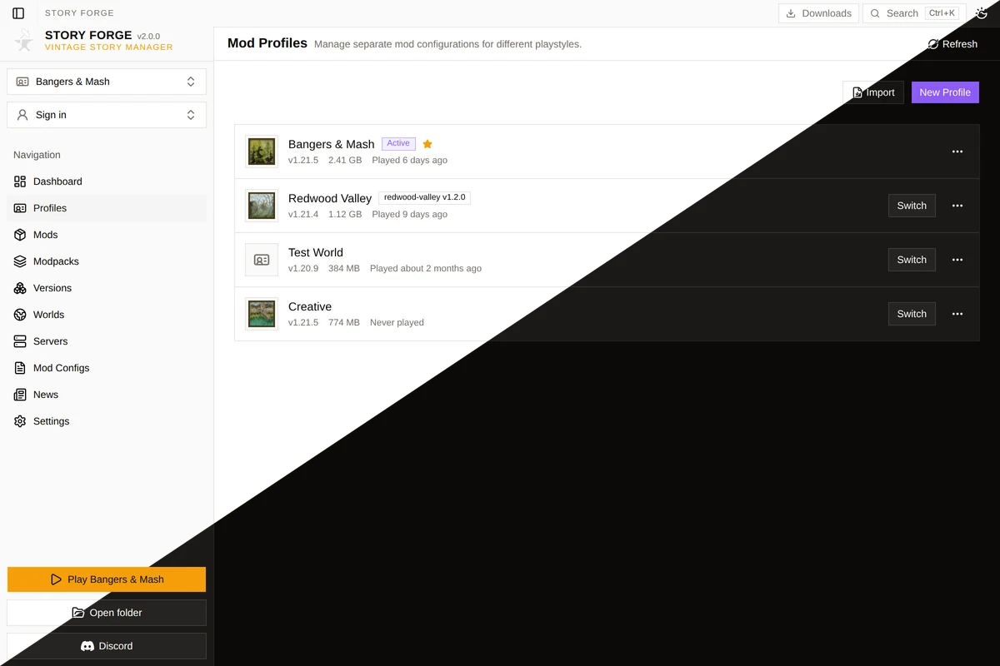 | 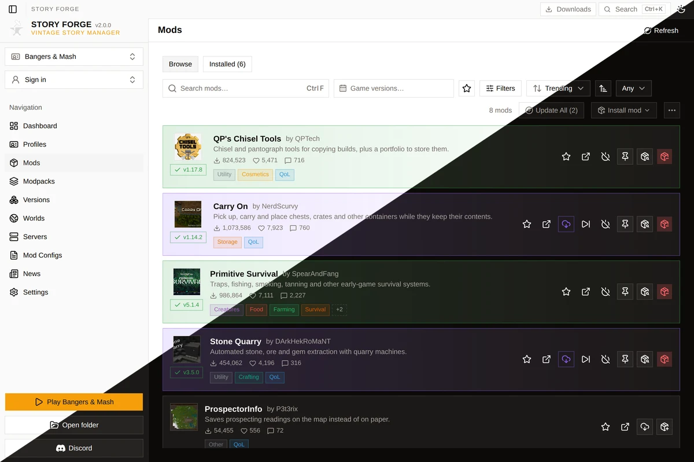 | 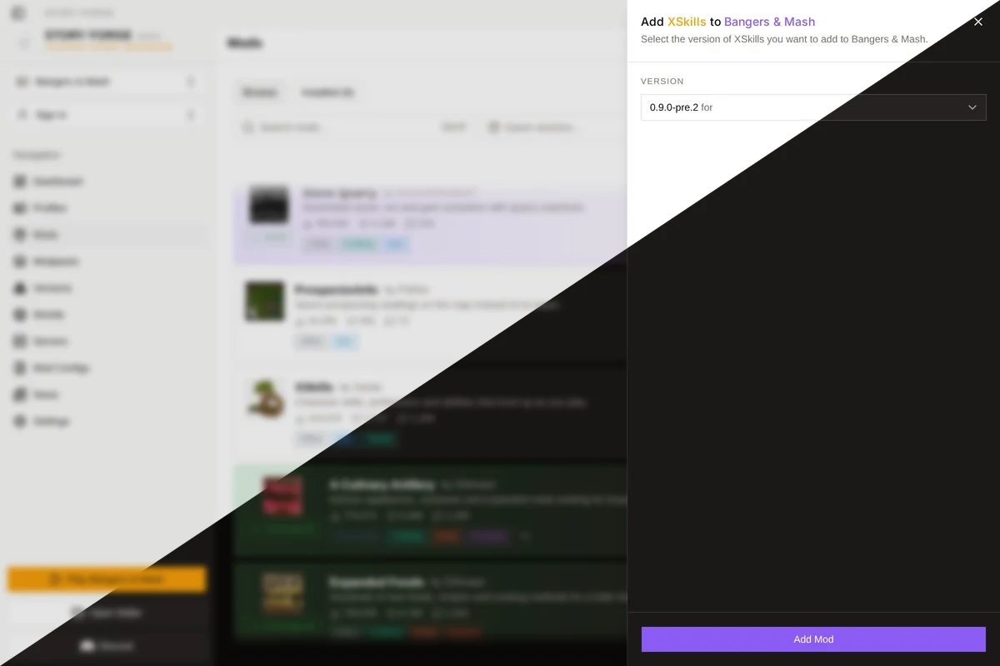 |

|                Versions                |               Worlds               |                   Public servers                   |
| :------------------------------------: | :--------------------------------: | :------------------------------------------------: |
| 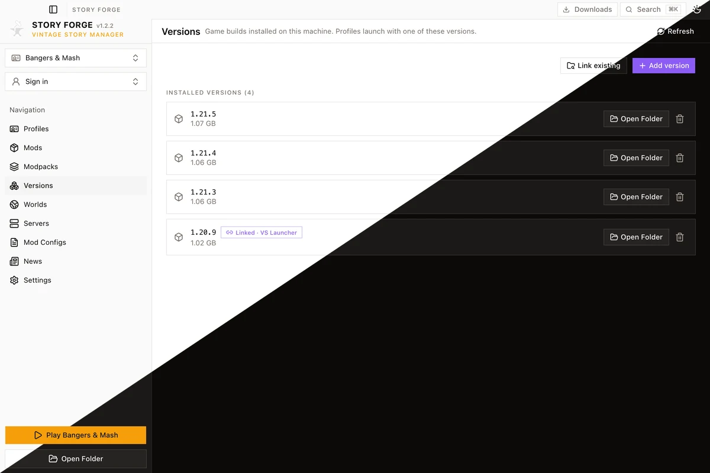 | 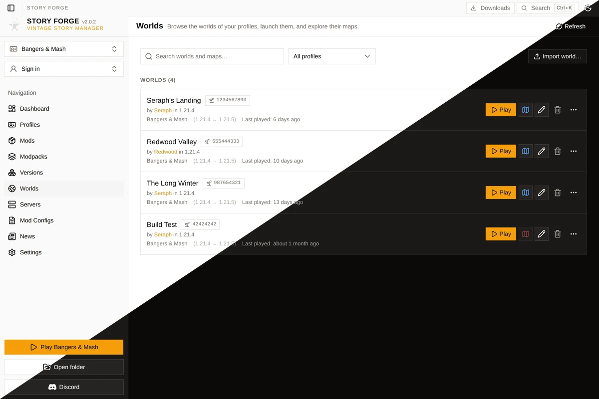 | 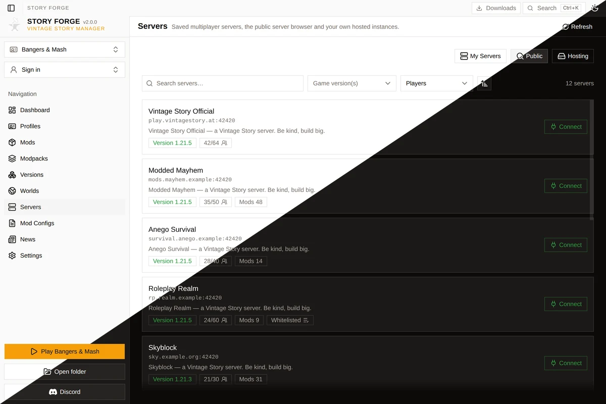 |

|               Servers                |               Hosting                |                 Mod configs                  |
| :----------------------------------: | :----------------------------------: | :------------------------------------------: |
| 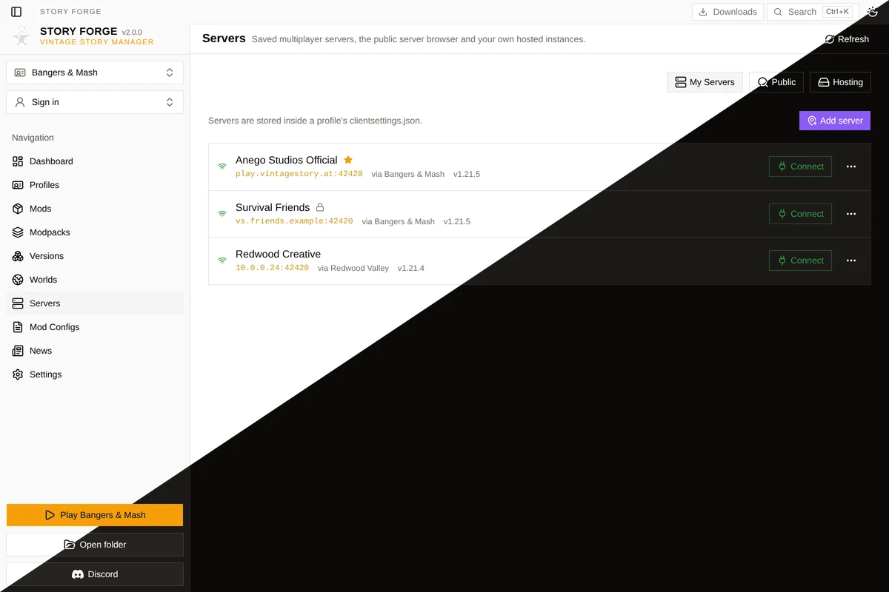 | 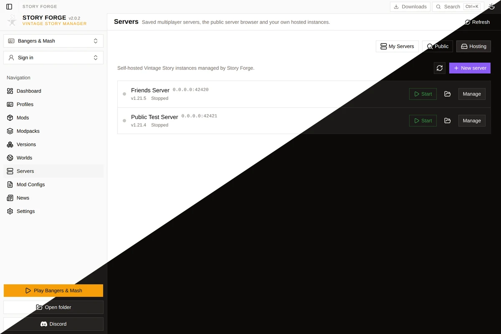 | 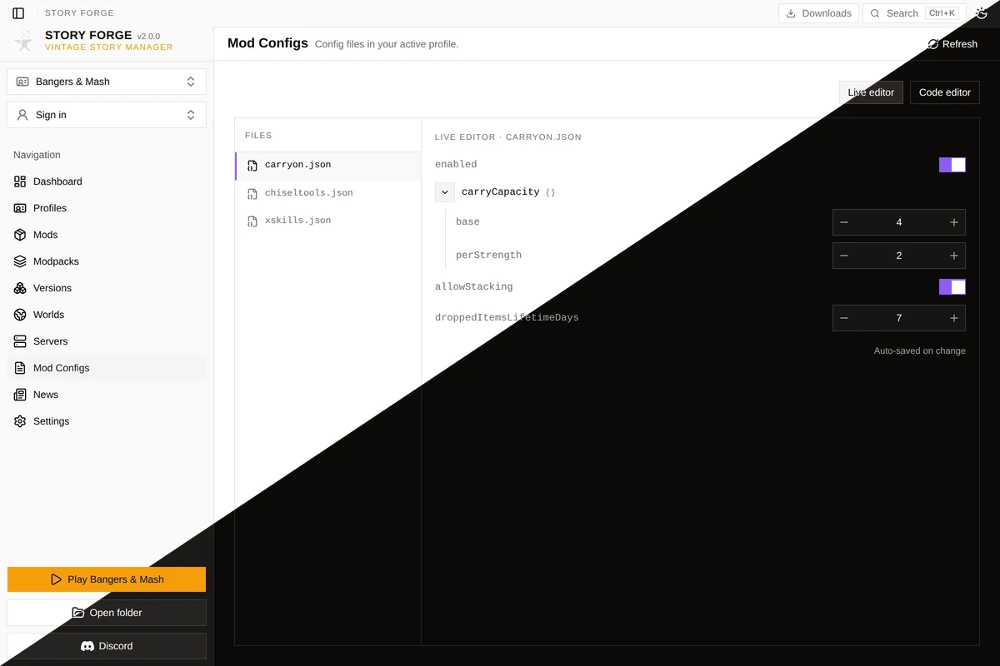 |

|              News              |                Settings                |
| :----------------------------: | :------------------------------------: |
| 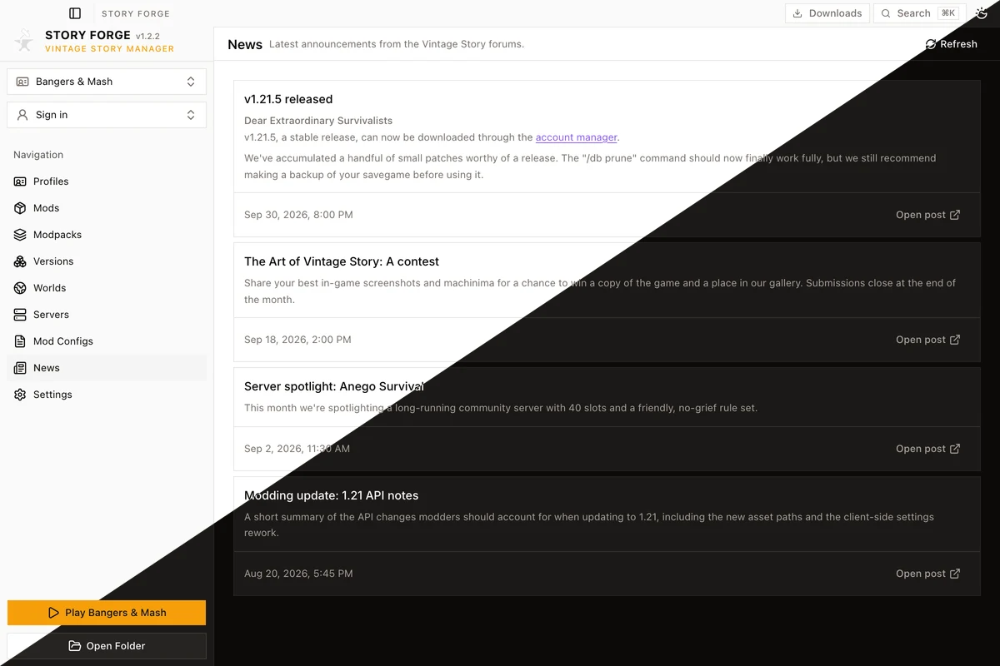 | 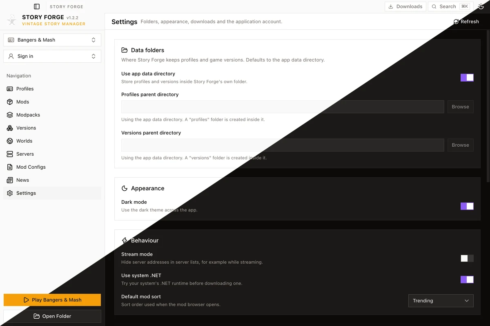 |

All screenshots are 1200×800 captures of the app UI, split light/dark along the diagonal; they are
refreshed headlessly on every published release. See
[screenshots/README.md](screenshots/README.md) for the pipeline.

## Development

```sh
bun install
bun tauri dev     # run the desktop app
bun run build     # typecheck + frontend build
bun tauri build   # bundle the app
```

Requires Bun, Rust (1.85+) and the [Tauri prerequisites](https://tauri.app/start/prerequisites/).

### Layout

```
src/                  React 19 + TanStack Router/Query + Zustand frontend
  components/ui/      Base UI primitives (Macheim design system)
  components/layout/  titlebar, sidebar, header, main layout
  components/<area>/  feature pages and sheets
  hooks/ stores/      data layer (ported from the original app, renamed to profiles)
  lib/                helpers, types, notify, query client
src-tauri/            Rust backend (Tauri v2)
  src/modules/        profiles, versions, mods, servers, hosting, saves, maps, auth, dotnet…
```

App data lives in the platform app-data directory (macOS: `~/Library/Application Support/StoryForge`),
with `profiles/`, `versions/`, `hosted-servers/`, logs and settings inside. Both the profiles
and versions folders can be relocated in Settings.

### Notes

- `PORTING.md` documents how the remake maps onto the original app (may be deleted later).
- The updater endpoint still points at the original project's release feed; the version is ahead
  of it so no downgrade is offered.
